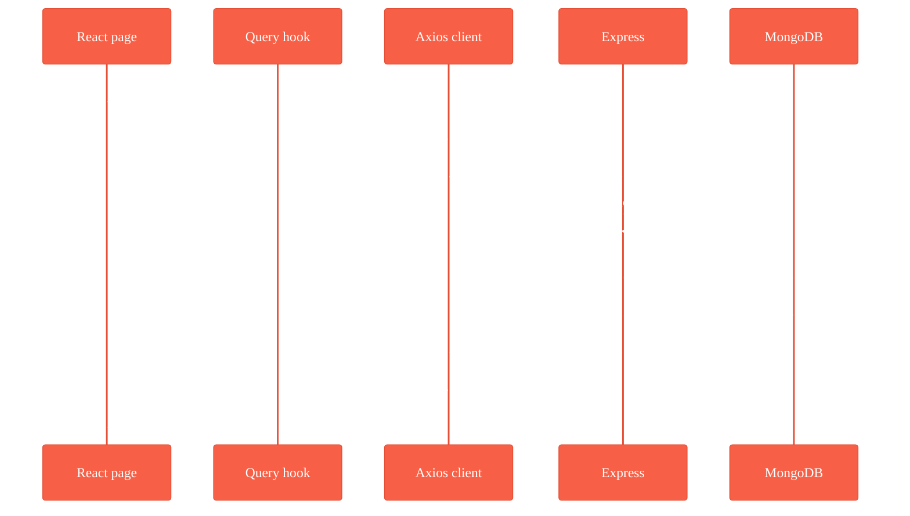
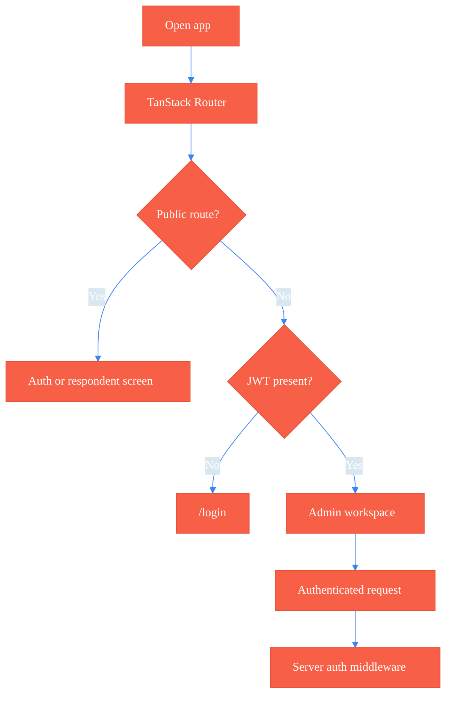
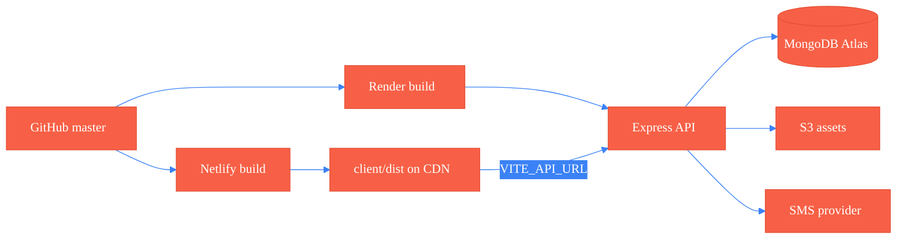

<div align="center">


# SurveyFlow

**Build a survey once. Publish it as a link. Collect, validate, and analyse the answers — without hard-coding a single form.**

<a href="https://surveyflow-eric.netlify.app"></a>
<a href="https://surveyflow-api.onrender.com"></a>
<a href="https://surveyflow-api.onrender.com/api/health"></a>


<br />


</div>

---


SurveyFlow is a full-stack MERN survey platform. An authenticated admin workspace
authors schema-driven questionnaires; public respondent pages collect the answers;
recipient whitelisting, branding, SMS invitations, analytics, and exports wrap
around both halves.

---

## Contents

| Getting started | The system | Reference |
|---|---|---|
| [Live environments](#live-environments) | [Design decisions](#design-decisions) | [HTTP surface](#http-surface) |
| [Prerequisites](#prerequisites) | [Repository layout](#repository-layout) | [Screens](#screens) |
| [Setup](#setup) | [Domain model](#domain-model) | [Design tokens](#design-tokens) |
| [Configuration](#configuration) | [Authentication](#authentication) | [Scripts](#scripts) |
| [Running](#running) | [Testing](#testing) | [Deployment](#deployment) |
| [Seed data](#seed-data) | | [Maintaining this document](#maintaining-this-document) |

---

## Live environments

| Tier | Host | URL |
|---|---|---|
| Client | Netlify | <https://surveyflow-eric.netlify.app> |
| API | Render | <https://surveyflow-api.onrender.com> |
| **API reference** | Render | <https://surveyflow-api.onrender.com> — interactive Scalar docs at the API root |
| OpenAPI document | Render | <https://surveyflow-api.onrender.com/openapi.json> |
| Health probe | Render | <https://surveyflow-api.onrender.com/api/health> |

> [!NOTE]
> The API runs on Render's free tier, which sleeps after inactivity. The first
> request after an idle period can take ~50 seconds to wake the instance.

---

## Design decisions

Three choices shape most of the codebase.

> **Surveys are data, not code.**
> A survey is a document of sections and questions with rules attached. Nothing
> about a specific questionnaire is compiled into the app, so adding a question
> type is a renderer change rather than a migration.

> **Branching logic runs on both sides.**
> `server/utils/logicEngine.js` and `client/src/lib/utils/logicEngine.js` are
> deliberate twins. The client needs the rules to decide what to show next; the
> server needs the same rules to decide what it will accept. Keeping them in sync
> is a maintenance cost paid on purpose — change one, change the other, and the
> logic-engine unit tests will tell you when you have not.

> **One renderer, three contexts.**
> Editor preview, public response, and response detail mount the same components
> against the same schema, so a question looks and behaves identically in all three.

---

## Prerequisites

| Requirement | Version |
|---|---|
| Node.js | 20 or newer (Netlify builds on 22) |
| MongoDB | Local `mongod` or an Atlas cluster |

---

## Setup

```bash
git clone https://github.com/Ericokim/SurveyFlow.git
cd SurveyFlow

npm install                    # API dependencies
npm install --prefix client    # client dependencies

cp .env.example .env           # then fill it in
```

---

## Configuration

`.env` at the repository root configures the API. Vite reads that same file for
the client and lets `client/.env*` override it; only `VITE_`-prefixed values ever
reach browser code.

| Variable | Required | Notes |
|---|---|---|
| `PORT` | no | API port. Defaults to `5001`. Render injects its own. |
| `NODE_ENV` | no | `development` or `production`. |
| `MONGO_URI` | **yes** | MongoDB connection string. |
| `JWT_SECRET` | **yes** | Signing secret, 256 bits or more. |
| `JWT_EXPIRY` / `JWT_REFRESH_EXPIRY` | no | Token lifetimes. |
| `FRONTEND_URL` | yes in prod | Client origin. Builds distribution and password-reset links. |
| `SMS_API_KEY` / `SMS_USERNAME` / `SMS_SENDER_ID` | no | SMS invitations. Leave blank to disable. |
| `COMMS_API_URL` / `COMMS_APP_ID` | no | External comms API. Blank logs email to the console. |
| `AWS_REGION` / `AWS_ACCESS_KEY_ID` / `AWS_SECRET_ACCESS_KEY` / `AWS_S3_BUCKET_NAME` | no | S3 asset storage. |
| `DEV_BYPASS_AUTH` / `DEV_USER_ID` / `DEV_COMPANY_ID` | no | Development-only auth bypass. See [Authentication](#authentication). |
| `VITE_API_URL` | no | API origin *without* `/api`; the axios client appends it. Unset means same-origin `/api`. |

`.env` and `.env.local` are gitignored. Keep real credentials out of `.env.example`.

> [!WARNING]
> A `VITE_API_URL` exported in your **shell** outranks every `client/.env*` file,
> because Vite gives real environment variables precedence. If a production build
> mysteriously points at `localhost`, check `echo $VITE_API_URL` before anything
> else, and override it explicitly:
> `VITE_API_URL="https://surveyflow-api.onrender.com" npm run build`.

---

## Running

```bash
npm run dev        # API + client together, via concurrently
npm run server     # API only, nodemon
npm run client     # Vite dev server only
npm start          # production API
npm run build      # install client deps and build the client bundle
```

| Service | URL |
|---|---|
| API | `http://localhost:5001` |
| Client | `http://localhost:5173` |
| Health check | `GET http://localhost:5001/api/health` |

---

## Seed data

```bash
npm run data:import              # baseline companies, users, surveys
npm run data:import:ieq          # Internet Experience Questionnaire dataset
npm run data:import:ieq:publish  # ...and publish it immediately
npm run data:destroy             # wipe seeded data
```

The IEQ dataset in `server/data/ieq.combined.master.json` doubles as a test
fixture: it is a real questionnaire with non-trivial branching, so the
logic-engine suites run against it rather than against toy input.

---

## Repository layout

```
SurveyFlow/
├── client/                     React 19 + Vite — see client/README.md
│   ├── src/app/                provider tree, router, context
│   ├── src/routes/             file-based TanStack routes
│   ├── src/pages/              route-level screens
│   ├── src/components/         editor, renderer, analytics, shared, ui
│   ├── src/lib/api/            axios modules, one per API domain
│   ├── src/lib/queries/        TanStack Query hooks
│   ├── src/lib/utils/          survey, logic, export, presentation helpers
│   ├── src/stores/             zustand auth store
│   ├── src/styles/theme.css    design tokens — the palette lives here
│   ├── public/brand/logos/     SurveyFlow mark and wordmark
│   └── tests/                  node:test unit specs, Playwright e2e
├── server/
│   ├── server.js               entry: middleware, /api mount, shutdown
│   ├── config/                 database connection
│   ├── docs/openapi.js         OpenAPI 3.1 document — rendered by Scalar at /
│   ├── routes/                 express routers, mounted by routes/index.js
│   ├── controllers/            request handlers
│   ├── services/               branding, email, http, upload
│   ├── models/                 mongoose schemas
│   ├── middleware/             auth, validation, request id, errors
│   ├── utils/                  logging, responses, logicEngine, s3, paging
│   ├── data/                   seed fixtures + IEQ dataset
│   └── tests/                  unit + integration specs
├── netlify.toml                client build + SPA fallback
├── render.yaml                 API service blueprint
└── package.json                root scripts drive both halves
```

---

## Domain model

| Model | Holds |
|---|---|
| `user` | Admin accounts and preferences. |
| `company` | Workspace, branding, defaults. |
| `survey` | Sections, questions, logic rules, publish state. |
| `survey_version` | Immutable snapshot taken at publish time. |
| `recipient` | Whitelist entry, invite status, blacklist flag. |
| `response` | Submitted or in-progress answers. |
| `communication` | SMS and email delivery log. |

Versioning is what makes in-flight responses safe: publishing snapshots the
survey, so editing a live survey cannot retroactively change what a respondent
already saw.

**Question types** — short text, long text, single choice, multiple choice,
dropdown, rating, date.

---

## HTTP surface

Everything mounts under `/api` from `server/routes/index.js`.

> [!TIP]
> **Interactive reference:** <https://surveyflow-api.onrender.com> — all 52 endpoints
> with schemas, auth, and runnable requests, rendered by [Scalar](https://scalar.com)
> from `server/docs/openapi.js`. The raw document is at
> [`/openapi.json`](https://surveyflow-api.onrender.com/openapi.json); locally it is
> <http://localhost:5001>.
>
> The spec is hand-authored so request bodies mirror the Joi validators, and
> `server/tests/unit/openapiCoverage.test.mjs` fails the build if any `@route`
> annotation goes undocumented — the docs cannot silently drift from the router.

| Router | Prefix | Covers |
|---|---|---|
| `auth.routes.js` | `/api/auth` | Register, login, current user, preferences, forgot/reset password. |
| `company.routes.js` | `/api/company` | Profile, workspace settings, company logo upload and serve. |
| `surveys.routes.js` | `/api/surveys` | CRUD, publish, close, duplicate, restore, survey logo, effective settings. |
| `recipients.routes.js` | `/api/surveys/:id/recipients` | Create, bulk upload, stats, invite, blacklist, delete. |
| `distribution.routes.js` | `/api/surveys/:id/sms` | Send invitations, sending stats, delivery logs. |
| `responses.routes.js` | `/api/r/:publicId`, `/api/admin` | Public fetch, whitelist check, progress save, preview and live submit; admin list, detail, delete, recipient reset. |
| `analytics.routes.js` | `/api/surveys/:id/analytics` | Survey and per-question analytics, response/recipient/respondent exports. |



---

## Screens

Routes are declared as files in `client/src/routes/` and compiled into
`client/src/routeTree.gen.js` by `npm run route:generate`.

**Public** — no session required:

| Path | Screen |
|---|---|
| `/login`, `/register` | Authentication. |
| `/forgot-password`, `/reset-password/$token` | Password recovery. |
| `/r/$publicId` | Respondent survey page. |
| `/r/$publicId/preview` | Read-only preview of a published survey. |
| `/r/$publicId/test` | Test mode — submissions are not recorded. |
| `/preview/draft` | Draft preview launched from the editor. |

**Authenticated workspace:**

| Path | Screen |
|---|---|
| `/` | Dashboard. |
| `/surveys` | Survey list. |
| `/surveys/$id` | Survey editor and detail. |
| `/settings` | Workspace and branding settings. |

---

## Authentication

The API issues a JWT on login. The client keeps it locally, the axios interceptor
attaches it to every request, and a 401 outside the public respondent routes
clears the session and returns to `/login`.



Admin routes sit behind server auth middleware. Three routers —
`surveys.routes.js`, `responses.routes.js`, and `analytics.routes.js` — honour a
development bypass so local work and automated runs do not need a login
round-trip. It activates only when **both** conditions hold:

```js
(process.env.NODE_ENV || "development") !== "production" &&
process.env.DEV_BYPASS_AUTH !== "false"
```

Even then, a request must either carry a `Bearer` token or supply valid
`DEV_USER_ID` and `DEV_COMPANY_ID` ObjectIds; otherwise it still gets a 401.

> [!CAUTION]
> The bypass is **opt-out, not opt-in** — it is on by default in any environment
> that is not `production`. `NODE_ENV=production` is what disables it on Render.
> If you run a staging or demo box on any other `NODE_ENV`, set
> `DEV_BYPASS_AUTH=false` explicitly.

---

## Design tokens

The palette lives in exactly one file — `client/src/styles/theme.css` — expressed
in `oklch`. SurveyFlow is a coral / warm-orange primary with a soft-blue analytics
accent, defined for light (`:root`) and dark (`.dark`).

| Token | Role |
|---|---|
| `--primary`, `--primary-hover`, `--primary-foreground` | Coral brand actions. |
| `--accent`, `--accent-foreground` | Soft-blue analytics accent. |
| `--background`, `--foreground`, `--card`, `--popover` | Surfaces and text. |
| `--chart-1` … `--chart-5` | Chart series. Lead pair is blue + coral. |
| `--sidebar-*` | Sidebar surfaces. |
| `--surveyflow-*` | Aliases consumed by the decorative helpers. |
| `--radius` | Corner-radius scale root, `0.75rem`. |

Tailwind's `@theme inline` block re-exports each token as a utility colour, so
components write `bg-primary` and never a hex value. Change the palette in
`:root` / `.dark` and it propagates everywhere — that is the whole point, so
please do not reintroduce literal colours.

Helpers layered on the tokens: `.sf-page`, `.sf-gradient-primary`,
`.sf-auth-panel`. Brand artwork lives in `client/public/brand/logos/`.

---

## Scripts

| Command | Does |
|---|---|
| `npm run dev` | API + client together. |
| `npm run server` / `npm run client` | One half at a time. |
| `npm start` | Production API. |
| `npm run build` | Install client deps, then build to `client/dist`. |
| `npm run data:import` · `:ieq` · `:ieq:publish` · `npm run data:destroy` | Seed management. |
| `npm test` | Unit suites, client + server. |
| `npm run test:integration` | Server integration suite — needs a reachable MongoDB. |
| `npm run test:e2e` | Playwright. |
| `npm run test:all` | Unit + e2e. |
| `npm run qa:all` / `npm run qa:open` | Run everything, then build/open the Allure report. |
| `npm run route:generate --prefix client` | Regenerate the TanStack route tree. |

---

## Testing

Unit tests use the Node built-in test runner, so there is no extra framework to
install. End-to-end coverage is Playwright, reported through Allure.

```bash
npm test                 # unit suites, client + server
npm run test:integration # server integration suite — needs a reachable MongoDB
npm run test:e2e         # Playwright
npm run test:all         # unit + e2e
npm run qa:all           # test:all, then build the Allure report
npm run qa:open          # open the report
```

Covered areas: survey lifecycle and publishing, survey editing, question and
response validation, progress save, preview submission, recipient upload and
status, analytics export, duplication and cloning, logic-engine branching and
section skips, public response flows, and branding settings.

| Suite | Tests | Result |
|---|---|---|
| Client unit | 73 | passing |
| Server unit | 44 | passing |
| **Total** | **117** | **passing** |

Six of the server tests are the OpenAPI coverage suite, which asserts that all 52
`@route` annotations are documented, that no documented operation is orphaned,
that every `$ref` resolves, and that authenticated operations declare bearer auth.

---

## Deployment

The client is a static bundle on **Netlify**; the API is a Node process on
**Render**; MongoDB Atlas backs both. Configuration is committed as
`netlify.toml` and `render.yaml`.



| Concern | Netlify (client) | Render (API) |
|---|---|---|
| Live URL | <https://surveyflow-eric.netlify.app> | <https://surveyflow-api.onrender.com> |
| Build | `npm run build` in `client/`, publish `dist` | `npm install` at the root |
| Start | static | `node server/server.js` |
| Health | — | [`/api/health`](https://surveyflow-api.onrender.com/api/health) |
| API docs | — | [`/`](https://surveyflow-api.onrender.com) (Scalar) · [`/openapi.json`](https://surveyflow-api.onrender.com/openapi.json) |
| SPA routing | `/*` → `/index.html` (200) so TanStack Router owns deep links | — |
| Key env | `VITE_API_URL` | `MONGO_URI`, `JWT_SECRET`, `FRONTEND_URL`, AWS/SMS |

Manual deploy of the client:

```bash
npm install && npm install --prefix client
VITE_API_URL="https://surveyflow-api.onrender.com" npm run build
netlify deploy --prod --dir=client/dist
```

> [!IMPORTANT]
> `VITE_API_URL` is baked into the bundle at **build** time, not read at runtime.
> Changing it on Netlify requires a fresh deploy, not just a settings save.

---

## Maintaining this document

Update this README in the same commit that changes any of:

- Setup steps or environment variable names
- npm scripts
- Route paths or API endpoint groups
- Auth behaviour, including the development bypass
- Survey schema, question types, or logic semantics
- Design tokens in `client/src/styles/theme.css`
- Test commands or deployment configuration

Before committing documentation or setup changes:

```bash
npm test
npm run build
```

---

<div align="center">
<sub>ISC licensed · <a href="https://github.com/Ericokim/SurveyFlow">github.com/Ericokim/SurveyFlow</a></sub>
</div>
