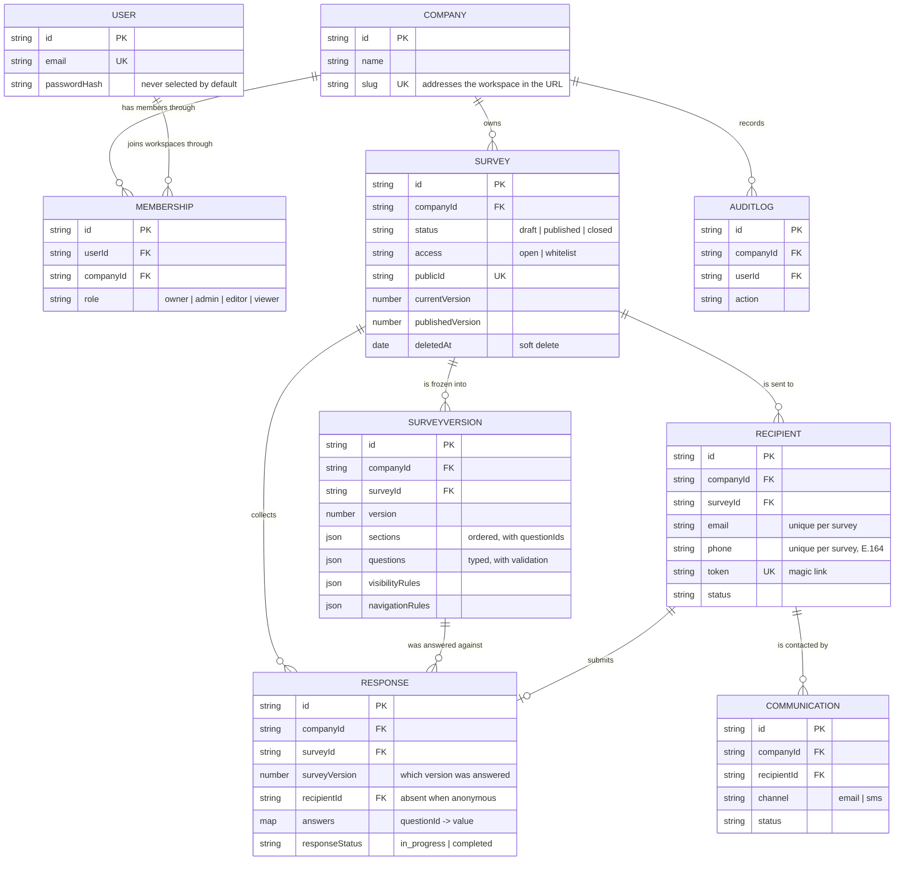

# Data model

How SurveyFlow's collections relate, and which ones are workspace-scoped.

A **workspace** (`Company`) is the tenant. Almost everything belongs to exactly one workspace and is filtered by `companyId` automatically — see [Tenant isolation](#tenant-isolation) below.

## Entity relationships

## The two relationships that matter most

**A person belongs to many workspaces.** `User` carries no `companyId` and no `role` — `Membership` holds both, one row per person per workspace, unique on the pair. This is why the same person can be an owner of one workspace and a viewer of another.

**A response is tied to the survey *as it was when answered*.** `Survey` is a pointer document; the questions live in `SurveyVersion`, an immutable snapshot. Every `Response` stores the `surveyVersion` it answered. Editing a published survey creates a *new* version rather than mutating the old one, so historical responses never change meaning and never dangle.

## Tenant isolation

| Collection | Auto-scoped? | Why |
|---|---|---|
| `Survey`, `SurveyVersion`, `Recipient`, `Response`, `Communication`, `AuditLog` | **Yes** | Workspace-owned data |
| `Company` | No | It *is* the workspace |
| `User` | No | A person exists across workspaces |
| `Membership` | No | It *establishes* the scope, so scoping it by that scope is circular |

Auto-scoped collections apply `tenantScopePlugin`, which adds `companyId` to every read, write, and delete, and **throws if no workspace is set** rather than returning everyone's rows. The only way past it is an explicit `.setOptions({ bypassTenantScope: true })`.

`Membership` is never queried unfiltered — always by the caller's own `userId` (from the session) or an explicit `companyId`.

## Status

All nine collections are built: `Company`, `User`, `Membership`, `AuditLog`, `Survey`, `SurveyVersion`, `Recipient`, `Response`, `Communication`.

Not built yet: the **logic engine** that evaluates `visibilityRules` and `navigationRules`, the public survey renderer, and response submission. The rules are stored and validated; nothing reads them at runtime.

Decisions behind this model are recorded in [`docs/specs/2026-07-23-multitenant-foundation.md`](../specs/2026-07-23-multitenant-foundation.md).
