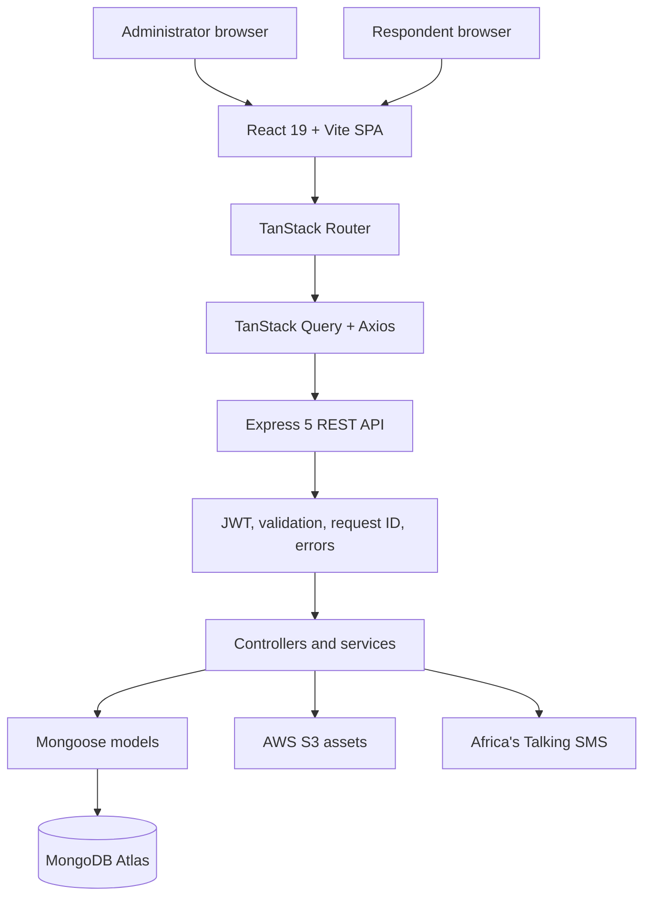
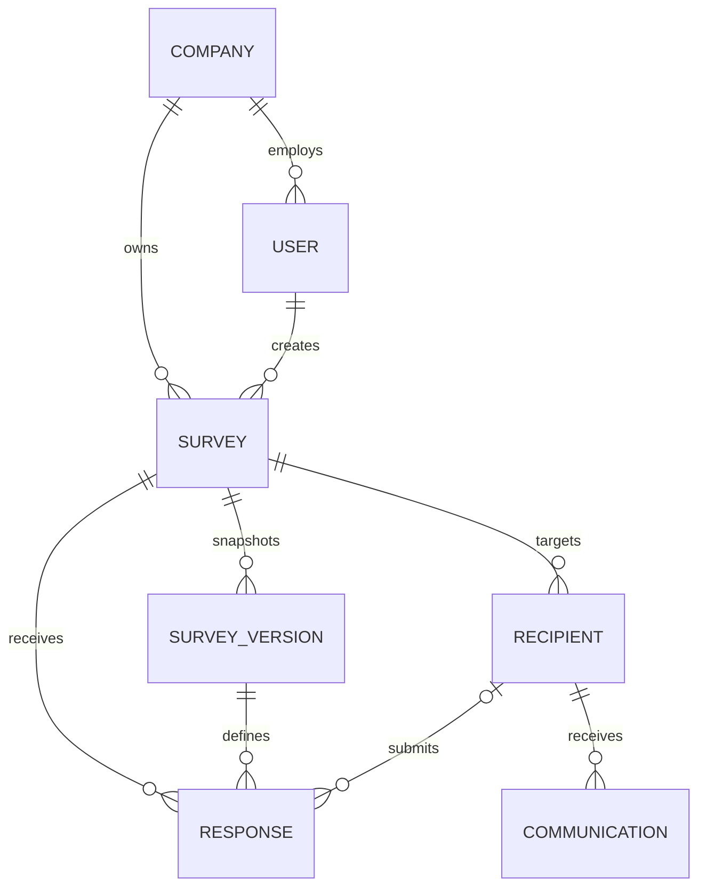
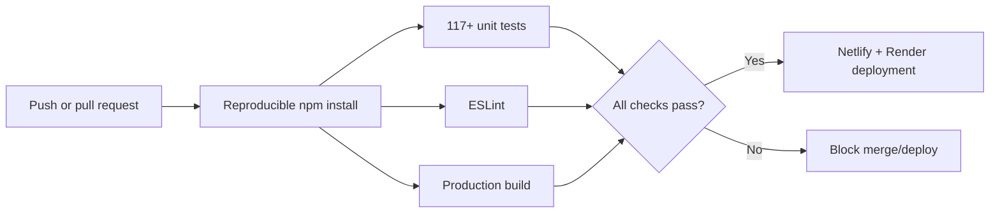
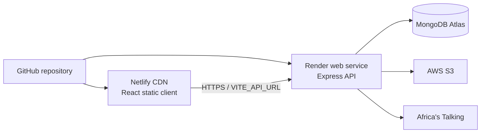

# SurveyFlow: Cloud-Based Survey and Feedback Management System

## Final Project Checkpoint Report

| Document item | Detail |
|---|---|
| Project | SurveyFlow |
| Domain | Social innovation and organizational research |
| Repository | [github.com/Ericokim/SurveyFlow](https://github.com/Ericokim/SurveyFlow) |
| Live application | [surveyflow-eric.netlify.app](https://surveyflow-eric.netlify.app) |
| API and interactive reference | [surveyflow-api.onrender.com](https://surveyflow-api.onrender.com) |
| API health check | [surveyflow-api.onrender.com/api/health](https://surveyflow-api.onrender.com/api/health) |
| Report date | 24 July 2026 |

---

## Table of Contents

- [Executive Summary](#executive-summary)
- [1. Problem Identification and Research](#1-problem-identification-and-research)
- [2. Product Definition](#2-product-definition)
- [3. Requirements and User Workflows](#3-requirements-and-user-workflows)
- [4. System Architecture](#4-system-architecture)
- [5. Design and Implementation](#5-design-and-implementation)
- [6. Security, Privacy, and Accessibility](#6-security-privacy-and-accessibility)
- [7. Testing, Continuous Integration, and Quality Status](#7-testing-continuous-integration-and-quality-status)
- [8. Cloud Deployment and Operations](#8-cloud-deployment-and-operations)
- [9. Evaluation, Risks, and Roadmap](#9-evaluation-risks-and-roadmap)
- [10. Ten-Minute Presentation Plan](#10-ten-minute-presentation-plan)
- [11. Local Setup and Maintenance](#11-local-setup-and-maintenance)
- [References](#references)
- [Appendix A: Checkpoint Evidence Map](#appendix-a-checkpoint-evidence-map)

---

## Executive Summary

SurveyFlow is a deployed full-stack platform for creating, publishing, distributing, completing, and analysing surveys. It addresses a social-innovation problem: schools, health programmes, community organizations, and research teams need structured feedback, but each form should not require a developer. Generic public forms can also be insufficient when respondent eligibility, branching, version stability, branding, or reporting matters.

Authenticated administrators build schema-driven surveys, configure logic, manage recipients, publish links, send invitations, and inspect analytics. Respondents use a focused public flow with optional whitelist access, progress saving, conditional navigation, validation, and version-linked submissions.

The system uses React/Vite, Node.js/Express, and MongoDB/Mongoose. Netlify hosts the client, Render the API, and MongoDB Atlas production data. On 24 July 2026, both public services returned HTTP 200, the health endpoint reported database and S3 availability, all 117 unit tests passed, and the production build succeeded.

This is a strong functional checkpoint, not an unqualified production-readiness claim. The repository has no CI workflow, and frontend lint reports 97 errors and 9 warnings. Unrestricted CORS, a disabled general rate limiter, browser-stored JWTs, incomplete role enforcement, and absent formal accessibility/privacy audits are release risks. CI and security hardening should be the next release gate.

---

## 1. Problem Identification and Research

### 1.1 Real-world problem

Organizations collect feedback for education quality, patient experience, programme monitoring, community consultation, and research. They must design valid questions, reach the intended audience, prevent duplicates, adapt later questions, preserve what each person saw, and turn submissions into decisions. Disconnected spreadsheets, messaging tools, and forms duplicate work and weaken traceability.

The World Bank describes survey and citizen-generated data as a public-good input for evidence-based corrective action. Its Punjab citizen-feedback example connected feedback to service improvements and thousands of corrective measures ([World Bank, 2021](https://wdr2021.worldbank.org/stories/data-as-a-force-for-public-good/)). Its Service Delivery Indicators programme uses surveys to identify gaps, benchmark performance, and inform health and education interventions ([World Bank, n.d.](https://www.worldbank.org/en/programs/service-delivery-indicators)). Feedback has social value when collected consistently and converted into action.

Digital questionnaires also create design trade-offs. An experiment reported in the *Journal of Survey Statistics and Methodology* found that single-item and short, carefully constructed grid formats performed better than a particular branched-response format on important data-quality measures ([“Optimal Response Formats for Online Surveys,” 2021](https://doi.org/10.1093/jssam/smz039)). That “branched-response” format is not the same as SurveyFlow's conditional routing, but the result still cautions against forcing every study into one visual layout. Research on mobile questionnaires likewise found that item grouping and scrolling can affect break-off behaviour and that no single page size is universally optimal ([Mavletova & Couper, 2016](https://doi.org/10.1177/1525822X15595151)). SurveyFlow therefore supports both question-based and section-based presentation rather than hard-coding one format.

The research implies five design needs:

1. reusable authoring instead of rebuilding each instrument;
2. configurable presentation and conditional logic;
3. controlled distribution and response integrity;
4. analysis close to the collection workflow; and
5. privacy and accessibility designed into the system.

### 1.2 Proposed solution and originality

SurveyFlow stores sections, questions, rules, validation, presentation, and branding as data rendered dynamically. It is reusable without compiling a new application per questionnaire. Publishing creates an immutable snapshot while the draft remains editable. Responses reference the published version, so later changes cannot silently alter earlier data.

The value proposition is:

> Build once, publish through a controlled link, collect only valid answers, and analyse results from the same workspace.

---

## 2. Product Definition

### 2.1 Product vision

Enable small and medium organizations to run credible, branded, logic-driven surveys without assembling separate form, recipient, messaging, and reporting systems.

### 2.2 Target users

| User | Job to be done | Current product response |
|---|---|---|
| Research administrator | Create and preserve an instrument without code | Editor, validation, preview, versioned publishing |
| Operations officer | Reach a known audience and track participation | CSV upload, whitelist, SMS, recipient status |
| Analyst | Understand completion and answer patterns | Dashboard, analytics, filters, exports |
| Respondent | Complete only relevant questions | Public link, conditional flow, validation, resume |

The code defines several user roles, but the current routed product primarily distinguishes authenticated administrators from public respondents. Granular authorization for viewer or specialist roles remains future work.

### 2.3 Scope

Implemented scope includes authentication, password recovery, branding, survey lifecycle, soft deletion/restoration, seven question types, sections, preview, conditional logic, versioned publishing, recipient upload, whitelisted access, progress saving, one-response controls, SMS distribution, analytics, and exports.

Out of scope for the present release are billing, enterprise single sign-on, real-time collaborative editing, a native mobile application, offline response capture, multilingual authoring, advanced statistical modelling, and a complete role-permission administration interface.

### 2.4 Product success measures

The deployment does not yet contain a formal product-analytics baseline, so the following are target measures rather than claimed results:

| Measure | Initial target | Why it matters |
|---|---:|---|
| First survey published without support | at least 85% | Authoring clarity |
| Median simple-survey setup time | under 10 minutes | Efficiency |
| Valid final-submission rate | at least 95% | Respondent UX |
| Public response availability | 99.5% monthly | Reliability |
| Critical accessibility/security defects | zero at release | Inclusive, safe use |

---

## 3. Requirements and User Workflows

### 3.1 Functional requirements

| ID | Requirement | Implementation evidence | Status |
|---|---|---|---|
| FR-01 | A user can create a workspace and authenticate | Auth pages, JWT API, company creation | Implemented |
| FR-02 | An administrator can create and edit a survey without code | Schema-driven editor and survey API | Implemented |
| FR-03 | A survey supports sections, common question types, validation, and logic | Seven renderers, schemas, twin logic engines | Implemented |
| FR-04 | An administrator can preview before publishing | Draft, test, and published-preview routes | Implemented |
| FR-05 | Publishing preserves the questionnaire shown to respondents | `SurveyVersion` snapshots and response version references | Implemented |
| FR-06 | Access can be open or restricted to recipients | Whitelist gate, hashed identifier lookup, blacklist | Implemented |
| FR-07 | Respondents can save progress and submit valid answers | Progress and submission endpoints | Implemented |
| FR-08 | An organization can distribute and track invitations | Recipient management, SMS service, communication logs | Implemented |
| FR-09 | Administrators can review and export outcomes | Analytics, response management, exports | Implemented |
| FR-10 | The system exposes a documented API | OpenAPI 3.1 and interactive Scalar reference | Implemented |
| FR-11 | Every change is automatically tested before deployment | Repository CI workflow | Not implemented |

### 3.2 Core workflows

**Administrator:** authenticate → create → add sections/questions → configure logic → preview → optionally upload recipients → publish/share → monitor → analyse/export → close.

**Respondent:** open public link → pass the whitelist gate when enabled → answer visible questions → follow conditional navigation → save/resume when identified → submit → view the configured thank-you message.

**Lifecycle:** draft → preview/test → immutable publish → live collection → close. Surveys can also be duplicated, soft-deleted, or restored; test and live submissions remain separate.

---

## 4. System Architecture

### 4.1 Logical architecture



File-based routes separate authenticated and public screens. TanStack Query manages remote state; Axios centralizes API access; Zustand persists the session. The API separates routers, controllers, services, middleware, and models beneath `/api`. Its deployed OpenAPI contract contains 45 paths and 53 operations; tests compare 52 route annotations with the contract, plus health.

### 4.2 Data model



| Model | Responsibility |
|---|---|
| `Company` | Workspace identity and default branding |
| `User` | Credentials, role, preferences, activity |
| `Survey` | Ownership, lifecycle, public ID, access and branding settings |
| `SurveyVersion` | Snapshot of questions, sections, presentation, and logic |
| `Recipient` | Eligible contact, invite state, progress state, blacklist |
| `Response` | Version-linked answers, status, progress, navigation, optional metadata |
| `Communication` | SMS/email attempt and delivery history |

Compound indexes support dashboard and analytics queries. Partial unique indexes protect recipient contacts and one-response rules per survey version.

### 4.3 Technology decisions

| Decision | Justification and trade-off |
|---|---|
| React + Vite | Component reuse and fast static builds suit separate admin and respondent interfaces; large editor chunks require later performance work |
| TanStack Router and Query | Typed/file-oriented navigation and centralized server-state lifecycle reduce page-level duplication |
| Express | A small modular REST boundary fits the team and JavaScript stack; it requires explicit conventions for validation and errors |
| MongoDB + Mongoose | A document model fits variable survey schemas and embedded rules; indexes and version snapshots control query and history risks |
| JWT bearer authentication | Simple separation between static client and API; browser token storage increases XSS impact and should be hardened |
| Netlify + Render | Independent static and API deployment keeps operational setup understandable and inexpensive; free-tier cold starts affect latency |
| OpenAPI 3.1 | A machine- and human-readable contract supports testing, maintenance, and future integrations |

---

## 5. Design and Implementation

### 5.1 Frontend

The frontend separates pages, workflow components, UI primitives, API/query modules, schemas, and utilities. The editor composes sections and sortable questions. Shared renderers keep preview and public completion consistent. Zod and React Hook Form provide immediate feedback; the backend remains authoritative.

Responsive layouts, focus styles, semantic primitives, themes, QR sharing, rich-text sanitization, and analytics/export helpers extend the product beyond CRUD. Editor and analytics chunks approach 900 kB before gzip, making bundle analysis a priority.

### 5.2 Backend

Express routers isolate product domains. Joi validates requests, controllers enforce rules, Mongoose adds persistence validation/indexes, and middleware returns consistent responses with error IDs.

Twin client/server logic engines drive display and independently validate applicability. The server rejects hidden, stale, malformed, or missing required answers, preventing client display decisions from becoming a trust boundary.

Publishing stores an immutable version, and live responses record `surveyVersion`. Progress includes completion, navigation, and save time. Later draft changes cannot rewrite an earlier questionnaire.

### 5.3 Scalability and reliability

The client is edge-cacheable, and the stateless API can scale horizontally. Compound indexes target major access patterns; compression, graceful shutdown, health checks, logging, and request IDs support operations.

Limitations include one API service, no SMS job queue, no load-test evidence, and no recovery objectives. Growth requires background jobs, retries, metrics, backup verification, and load tests.

---

## 6. Security, Privacy, and Accessibility

Controls include bcrypt hashing (cost 12), JWT expiry, hashed reset tokens, authentication rate limiting, Helmet, layered validation, tenant-scoped queries, hashed respondent identifiers, whitelist/blacklist checks, response constraints, rich-text sanitization, request IDs, and hidden production stacks. Metadata capture is survey-level opt-in.

These controls do not prove legal compliance. Kenya's Data Protection Act 2019 includes personal-data rights of access, correction, and deletion ([ODPC, 2024](https://www.odpc.go.ke/wp-content/uploads/2024/02/PERSONAL-DATA-PROTECTION-HANDBOOK.pdf)). Sensitive deployments still require a lawful basis, notices, retention/deletion rules, processor agreements, incident procedures, and any required impact assessment.

The most important security gaps are:

- CORS currently accepts all origins instead of an allow-list.
- General API rate limiting is present in source but disabled.
- JWTs are persisted in `localStorage`; secure, `HttpOnly`, `SameSite` cookies would reduce token theft through XSS.
- The `authorize` helper exists, but granular role checks are not applied across domain routes.
- No automated dependency, secret, static-security, or dynamic-security scan is committed.
- Health output reveals more infrastructure detail than a public probe requires.

Accessibility work includes labels, ARIA, focus treatment, contrast utilities, semantic primitives, and a keyboard-focus scenario. WCAG 2.2 covers identifiable errors, instructions, keyboard use, and exposed name/role/value ([W3C, 2023](https://www.w3.org/TR/WCAG22/)). Conformance requires automated and manual audits of complete journeys.

---

## 7. Testing, Continuous Integration, and Quality Status

### 7.1 Verification performed

The following checks were run locally on 24 July 2026:

| Check | Result |
|---|---|
| Client unit tests | 73 passed, 0 failed |
| Server unit tests | 44 passed, 0 failed |
| Total unit tests | **117 passed, 0 failed** |
| Production client build | Passed; 10,931 modules transformed |
| Public client request | HTTP 200 |
| Public API health request | HTTP 200; production database connected and S3 available |
| Deployed OpenAPI request | HTTP 200; 45 paths and 53 operations |
| Frontend lint | **Failed: 97 errors and 9 warnings** |
| Integration suite | Not rerun; requires a controlled database |
| Playwright end-to-end suite | Not rerun against production to avoid mutating live data |

Unit tests cover logic, validation, cloning, recipients, responses, exports, seeds, and OpenAPI drift. Twenty-four Playwright workflow files cover critical journeys, but configured files are not evidence of a current pass.

### 7.2 CI/CD assessment

Netlify and Render manifests are committed, but the repository has no GitHub Actions or equivalent CI workflow. Therefore FR-11 is not met.

The required CI quality gate should run on pull requests and pushes:



First repair the lint baseline. CI should run `npm ci`, unit tests, lint, build, and OpenAPI validation. Integration tests need an isolated database; Playwright needs a seeded test environment. Branch protection should require these checks.

---

## 8. Cloud Deployment and Operations

### 8.1 Production topology



| Layer | Deployment configuration |
|---|---|
| Client | Netlify builds `client` with Node 22 and publishes `client/dist`; unmatched routes return `index.html` |
| API | Render installs root dependencies, starts `node server/server.js`, and probes `/api/health` |
| Database | MongoDB connection supplied as a secret environment variable |
| Assets | AWS region, credentials, and bucket supplied to the API |
| Messaging | SMS credentials are optional; the service degrades with a warning when absent |

Provider settings hold secrets. Production requires `MONGO_URI`, strong `JWT_SECRET`, and `FRONTEND_URL`. Build-time `VITE_API_URL` changes require redeployment. `NODE_ENV=production` hides stacks and disables the development auth bypass.

### 8.2 Operational considerations

Render's free tier can sleep, delaying the first request. A production SLO needs an always-on instance or accepted cold-start budget. Monitoring should cover health, 5xx rate, latency, database, SMS, and S3; logs need redaction, and backups need restore tests.

The client, API reference, OpenAPI document, and health endpoint were reachable when verified. This proves deployment, not sustained availability.

---

## 9. Evaluation, Risks, and Roadmap

SurveyFlow meets the central functional objective: it identifies a consequential feedback-management problem, implements a modular full-stack solution, deploys it publicly, documents a complete cloud architecture, and provides meaningful automated tests. The versioned schema, server-side logic revalidation, respondent access controls, and integrated recipient/analytics workflows are the project's strongest original engineering decisions.

Release priorities are:

| Priority | Work | Acceptance criterion |
|---|---|---|
| P0 | Repair lint baseline and add CI | Unit, lint, and build checks pass and are required on every pull request |
| P0 | Harden authentication and network boundary | Origin allow-list, general rate limits, cookie-based session design, role enforcement |
| P0 | Complete privacy controls | Notice/consent, retention, export/access/deletion processes, DPIA where applicable |
| P1 | Establish accessibility evidence | Automated and manual WCAG 2.2 AA audit with critical defects closed |
| P1 | Isolate and run integration/e2e suites | Repeatable test environment and published reports |
| P1 | Add observability and recovery objectives | Dashboards, alerts, tested restore, defined RTO/RPO |
| P2 | Improve performance | Bundle budget, lazy loading, load tests, analytics query profiling |
| P2 | Expand product value | Email invitations, templates, multilingual surveys, granular roles |

The recommended final-submission definition of done is: P0 items complete; public URLs healthy; unit, lint, build, integration, and critical Playwright flows passing in CI; privacy and accessibility limitations stated; and the presentation recorded against the live system.

---

## 10. Ten-Minute Presentation Plan

| Time | Content and demonstration |
|---:|---|
| 0:00–0:50 | State the problem: feedback is valuable, but authoring, eligibility, distribution, version integrity, and analysis are fragmented |
| 0:50–1:30 | Introduce target users, value proposition, and research evidence |
| 1:30–3:00 | Log in, show the dashboard, create or open a survey, and explain the schema-driven editor |
| 3:00–4:10 | Add a question and demonstrate validation, section structure, and conditional navigation |
| 4:10–4:50 | Preview, publish, and explain immutable `SurveyVersion` snapshots |
| 4:50–5:50 | Show recipient upload/whitelisting, invitation options, and one-response controls |
| 5:50–6:50 | Open the public link, complete a branch, save/resume, and submit |
| 6:50–7:40 | Show analytics, response details, and export |
| 7:40–8:40 | Present the architecture and cloud-deployment diagram |
| 8:40–9:25 | Show test evidence, API documentation, and health endpoint |
| 9:25–10:00 | Close with limitations, P0 roadmap, and the product outcome |

Recording guidance: use a seeded demonstration survey; open all tabs before recording to absorb a possible Render cold start; hide real respondent data and secrets; keep the architecture diagram visible for the technical section; and finish with the public URL and repository.

---

## 11. Local Setup and Maintenance

Prerequisites are Node.js 20 or newer and MongoDB locally or remotely.

```bash
git clone https://github.com/Ericokim/SurveyFlow.git
cd SurveyFlow
npm install
npm install --prefix client
cp .env.example .env
npm run dev
```

Useful commands:

```bash
npm test
npm run test:integration
npm run test:e2e
npm run build
npm run lint --prefix client
```

Update this report when the scope, architecture, model, routes, security posture, test results, deployment targets, or public URLs change. Test counts in documentation should always come from a fresh run. Do not commit credentials, production exports, recipient files, or generated reports containing personal data.

---

## References

- Mavletova, A., & Couper, M. P. (2016). [Grouping of items in mobile web questionnaires](https://doi.org/10.1177/1525822X15595151). *Field Methods, 28*(2).
- Office of the Data Protection Commissioner. (2024). [Personal Data Protection Handbook](https://www.odpc.go.ke/wp-content/uploads/2024/02/PERSONAL-DATA-PROTECTION-HANDBOOK.pdf).
- [Optimal Response Formats for Online Surveys: Branch, Grid, or Single Item?](https://doi.org/10.1093/jssam/smz039) (2021). *Journal of Survey Statistics and Methodology, 9*(1), 1–24.
- World Bank. (2021). [Data as a force for public good](https://wdr2021.worldbank.org/stories/data-as-a-force-for-public-good/). *World Development Report 2021: Data for Better Lives*.
- World Bank. (n.d.). [Service Delivery Indicators](https://www.worldbank.org/en/programs/service-delivery-indicators).
- World Wide Web Consortium. (2023). [Web Content Accessibility Guidelines (WCAG) 2.2](https://www.w3.org/TR/WCAG22/).

---

## Appendix A: Checkpoint Evidence Map

| Checkpoint expectation | Evidence in this report or repository |
|---|---|
| Identify a real-world problem | Sections 1–2: feedback and service-improvement problem, research, users, value proposition |
| Short literature review | Section 1 and References |
| Complete system architecture | Section 4 diagrams, model, component and technology decisions |
| Clean, modular, scalable implementation | Sections 4–5 and repository layout described in `README.md` |
| Security and interdisciplinary design | Section 6 |
| Testing and CI | Section 7, including verified results and the documented CI gap |
| Public cloud deployment | Section 8 and the verified public links |
| Professional 2,500–3,500-word report | This document |
| Ten-minute presentation or demo | Section 10 provides the recording script |
